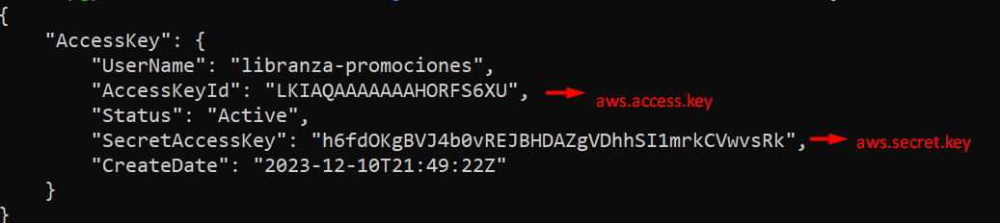
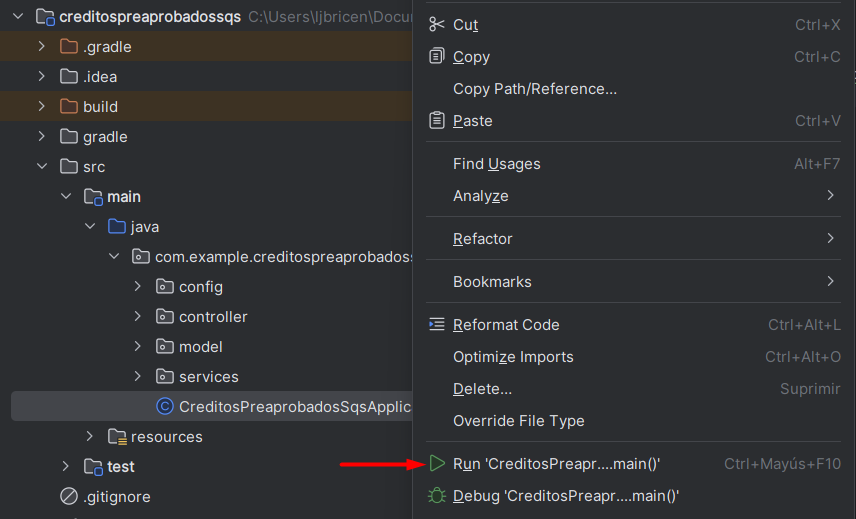

# Contexto para iniciar proyecto

## Inicializar LocalStack SQS
Para inicializar localstack se debe ejecutar el siguiente comando:
```
# sudo service docker start
# localstack start -d
# awslocal sqs create-queue --queue-name libranza-promociones
# awslocal iam create-user --user-name libranza-promociones
# awslocal iam create-access-key --user-name libranza-promociones
```
**NOTA**: Luego de ejecutar el último comando actualizar los siguientes 
parametros en el archivo application.properties



## Para detener LocalStack SQS
Para detener localstack se debe ejecutar el siguiente comando:
```
# localstack stop
```

## Ejecución del proyecto
Basta con ejecutar la clase CreditosPreaprobadosSqsApplication



## Para listar elementos de la cola
Para listar los elementos de la cola se debe ejecutar el siguiente comando:
```
# awslocal sqs receive-message --queue-url http://localhost:4566/000000000000/libranza-promociones
```

## Para verificar salud de la aplicación
Con la siguiente API se procede a comprobar la salud de la aplicación -> [Health](http://localhost:6094/api/actuator/health)
```
http://localhost:6094/api/actuator/health
```

## Endpoints
Todos los endpoints se pueden verificar y ejecutar entrando al siguiente enlace luego de ejecutar el proyecto

[Swagger-UI](http://localhost:6094/api/swagger-ui.html)
    
```
http://localhost:6094/api/swagger-ui.html
```